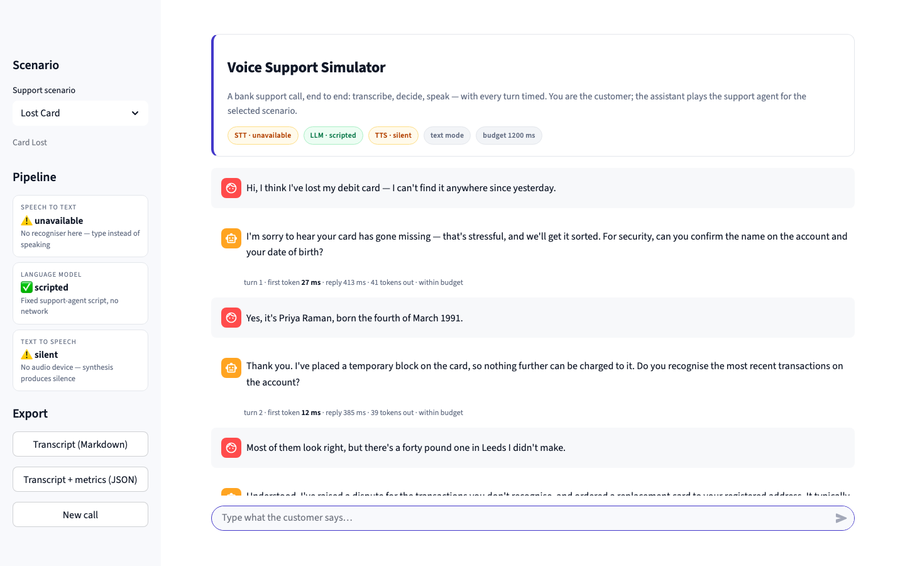
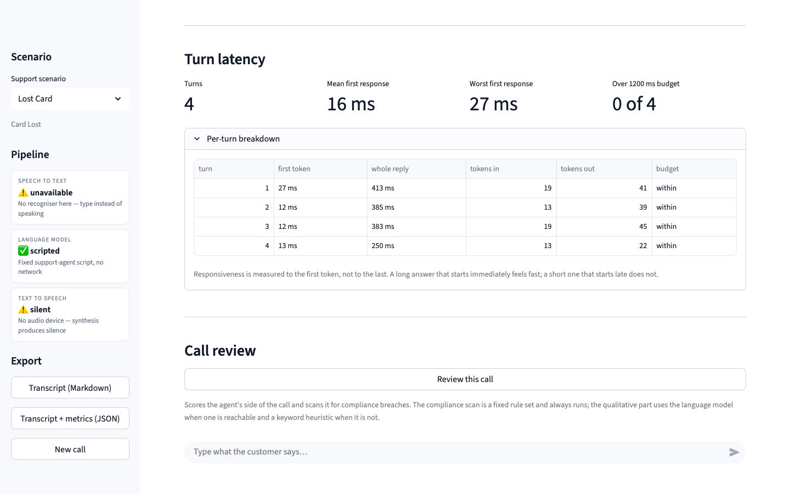
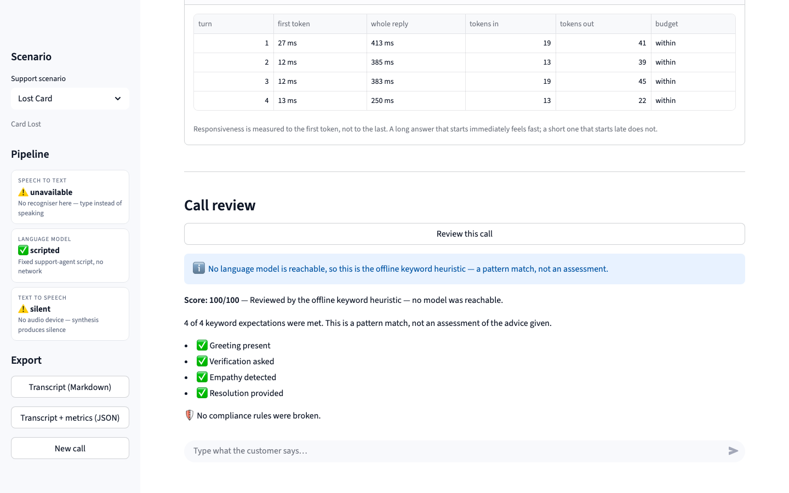
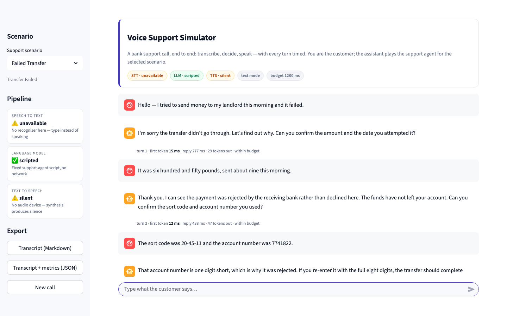
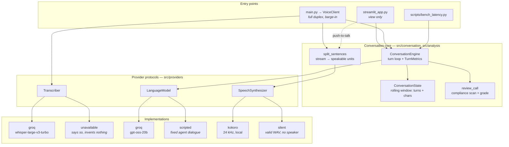
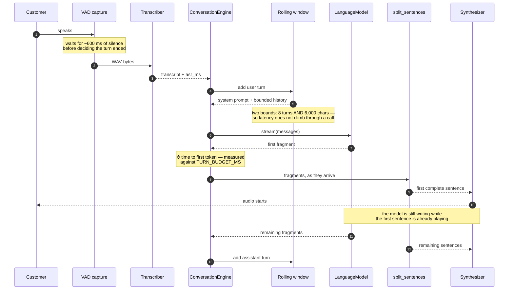

# Voice Support Simulator

A spoken-conversation simulator for bank support calls. You play the customer; the system plays
the support agent for one of three scenarios — a lost card, a failed transfer, a locked account.
It transcribes what you say, streams the agent's reply, speaks it back, and times every stage of
every turn.

The subject of the project is **the turn loop and its latency**, not the model: capture → ASR →
conversation window → LLM → TTS, with time-to-first-token measured against a budget and a
post-call review that scans the agent's own words for compliance breaches.

**It runs with no API key, no microphone and no speaker.** Each of the three stages resolves to a
provider that can actually run in the current environment, and the UI shows which ones it picked.

---

## Screenshots

A seeded call against the offline scripted agent — no network, no audio hardware, real timings.



The latency panel breaks the call down turn by turn. Responsiveness is measured to the *first*
token, not the last, because that is when the caller stops waiting.



The post-call review. The compliance scan is a fixed rule set and always runs; the qualitative
grade comes from the language model when one is reachable, and says so plainly when it does not.



Switching scenario starts a fresh call. The sidebar is honest about degradation throughout: with
no credentials the model is the scripted agent, transcription is unavailable and synthesis is
silent, and each says so rather than failing.



---

## Architecture

Three layers, with dependencies pointing inward. The entry points know about the engine; the
engine knows about the provider protocols; nothing above the seam knows about a vendor SDK.



The pattern is a **ports-and-adapters seam with a registry**. `src/providers/base.py` holds the
ports; `src/providers/builtin.py` holds the adapters; `src/providers/registry.py` resolves a name
to one of them, from an environment variable, with an `auto` mode that skips anything that cannot
run here. Adding a provider is a class and one decorator — see [Extensibility](#extending-it).

## A turn, and where the milliseconds go



The two annotated points are where a voice agent is won or lost. Everything before the first
fragment is dead air the caller hears; everything after it overlaps with playback and is free.

---

## Quickstart

### Docker

```bash
docker compose up -d --build
```

Open **http://localhost:8110**. No API key needed: without `GROQ_API_KEY` the model resolves to
the scripted agent, and the container seeds a real opening exchange on first load so the page is
not empty. Stop it with `docker compose down -v`.

The image installs `requirements/base.txt` only — the audio extras drive hardware a container does
not have, so torch, transformers, spaCy, PortAudio and the C toolchain are all left out.

### Locally

```bash
python3 -m venv project_venv
source project_venv/bin/activate

pip install -r requirements/base.txt   # pipeline + UI, no audio
pip install -r requirements.txt        # add the audio path (large: pulls torch)

cp .env.example .env                   # optional
streamlit run streamlit_app.py
```

With a microphone present the UI starts in voice mode; without one it starts in text mode. Force
either with `VOICE_IO=voice` or `VOICE_IO=text`.

**CLI client** — full-duplex voice with real barge-in. Needs a working microphone and speaker:

```bash
python main.py --persona card_lost --turns 3
```

`--persona` accepts `card_lost`, `transfer_failed` or `account_locked`. This is the only entry
point that writes `logs/latency_log.csv`.

**Benchmark** — measures the turn loop against any provider:

```bash
python scripts/bench_latency.py --turns 12
```

---

## Configuration

Read from the environment, or from a `.env` file (see `.env.example`).

| Variable | Required | Default | What it does |
|---|---|---|---|
| `GROQ_API_KEY` | no | empty | Present and real ⇒ hosted ASR and LLM become available. Absent or a placeholder ⇒ the offline providers are used |
| `LLM_PROVIDER` | no | `auto` | `groq`, `scripted`, or `auto` to pick the best that can run here |
| `STT_PROVIDER` | no | `auto` | `groq`, `unavailable`, or `auto` |
| `TTS_PROVIDER` | no | `auto` | `kokoro`, `silent`, or `auto` |
| `VOICE_IO` | no | `auto` | `text` skips ASR and TTS, `voice` forces the audio path, `auto` decides by whether a microphone exists |
| `TURN_BUDGET_MS` | no | `1200` | Turns slower than this to their first token are flagged in the UI. Nothing fails |
| `SEED_DEMO_CALL` | no | `0` | `1` plays a real opening exchange through the engine on first load |
| `GROQ_LLM_MODEL` | no | `openai/gpt-oss-20b` | Hosted chat model |
| `GROQ_ASR_MODEL` | no | `whisper-large-v3-turbo` | Hosted transcription model |
| `GROQ_TIMEOUT_SECONDS` | no | `30` | Per-request ceiling on hosted calls |
| `SEED` | no | unset | Seed passed to the chat completion |
| `KOKORO_VOICE` | no | `af_sky` | TTS voice |
| `KOKORO_LANG_CODE` | no | `a` | Kokoro language code (`a` = American English) |
| `ALLOW_FALLBACK_TTS` | no | `0` | `1` permits the macOS `say` fallback when Kokoro is unavailable |
| `FALLBACK_TTS_TIMEOUT_S` | no | `30` | Ceiling on that fallback subprocess |
| `LLM_PRICE_IN_PER_1K` | no | `0` | Used only for the per-turn cost estimate in the CLI log |
| `LLM_PRICE_OUT_PER_1K` | no | `0` | As above, for output tokens |

---

## Development

```bash
pip install -r requirements/dev.txt

python -m pytest tests/          # 287 tests
ruff check .                     # lint
ruff format --check .            # formatting
python scripts/bench_latency.py  # latency of the turn loop
```

The dev requirements deliberately exclude the audio extras: every device and every network call is
stubbed, so the whole suite runs on the base install, in a container, on a CI runner with no sound
card. `tests/conftest.py` strips `GROQ_API_KEY` from the environment for every test, so no test can
reach the network even on a machine with a real key exported.

In the container:

```bash
docker build --target test -t ai-voice-assistant:test . && docker run --rm ai-voice-assistant:test
```

---

## Project structure

```
streamlit_app.py            The UI. A view: no business logic, no provider calls
main.py                     CLI entry point — full-duplex client, CSV log, feedback
src/
├── providers/              The seam
│   ├── base.py             Transcriber / LanguageModel / SpeechSynthesizer protocols
│   ├── registry.py         name → factory, resolved from the environment
│   └── builtin.py          groq, scripted, kokoro, silent, unavailable
├── conversation/           The turn loop, with no UI attached
│   ├── engine.py           ConversationEngine, TurnMetrics, the latency budget
│   ├── streaming.py        split_sentences — token stream → speakable sentences
│   ├── transcript.py       Markdown and JSON export
│   └── seed.py             A real opening exchange, for first boot
├── analysis/
│   └── call_review.py      Compliance scan (deterministic) + model grade (fallback)
├── asr_module.py           ASRClient, VADStream, streaming capture
├── llm_module.py           LLMClient — streaming and whole completions
├── tts_module.py           Kokoro synthesis, interruptible PlaybackController
├── voice_client.py         Full-duplex CLI client with barge-in
├── simple_voice_handler.py Push-to-talk handler behind the UI
├── local_backend.py        Groq-shaped offline client, key and timeout helpers
├── audio_devices.py        Lazy PortAudio / ALSA / webrtcvad access
├── state_manager.py        ConversationState — rolling window, two bounds
├── persona_loader.py       Scenario definitions
├── feedback.py             Keyword scorer — the floor the review falls back to
└── logger.py               LatencyLogger — per-turn CSV
config/personas/            card_lost, transfer_failed, account_locked (JSON)
requirements/               base.txt, audio.txt, dev.txt
scripts/bench_latency.py    Turn-loop benchmark
scripts/preview-readme.sh   Render this README locally the way GitHub does
tests/                      pytest suite
docs/screenshots/           The images above
```

---

## Design notes

### The provider seam is the main structural decision

A voice agent is three exchangeable steps, and every interesting question about it — what happens
without a key, can you swap the recogniser, does a slow provider stall the loop — is a question
about those boundaries. So they are explicit: three protocols, three registries, and an `auto`
resolution that asks each candidate whether it can run before choosing it.

The payoff is that **degradation is a first-class state rather than an error path**. With no
credentials the app does not fail and does not pretend: the model becomes a fixed script, the
recogniser returns a message saying it cannot hear, synthesis produces well-formed silence, and the
UI shows all three. Every one of those stand-ins keeps the downstream code on its normal path —
the silent synthesiser emits a real WAV precisely so that WAV parsing, duration arithmetic and file
export are exercised rather than skipped.

The offline model is **scripted, not generated**. A bank-support trainer whose offline mode invents
plausible-sounding financial procedure is actively harmful, because the trainee cannot tell which
parts are real. Same reasoning for transcription: there is no local recogniser, and saying so beats
returning invented words for the rest of the pipeline to treat as what was said.

### Business logic moved out of the view

The turn loop used to live inside a Streamlit render function, which meant the numbers this project
exists to show could only be produced by rendering a page. `ConversationEngine` is plain Python:
the UI, the CLI and `scripts/bench_latency.py` all drive the same object, and the benchmark exists
because the loop became benchmarkable.

### Scalability here is latency, not throughput

This is a single-user simulator. Requests per second is the wrong question; the right one is how
long the caller waits before hearing anything, and whether that number grows. Three things were
addressed:

**Streaming, and synthesis that starts at the first sentence boundary.** Waiting for a whole
response before synthesising anything throws away most of a second per turn. `split_sentences`
consumes the token stream and hands complete sentences to the synthesiser while the model is still
writing — so the speaker, which plays at a fixed rate, becomes the bottleneck instead of the
provider. A test pins the interleaving explicitly: the second sentence must be produced *after* the
first has been spoken.

**Time to first token is what the budget measures.** Whole-turn latency is the wrong target: a long
answer that starts immediately feels fast, and a short one that starts late does not. Turns slower
than `TURN_BUDGET_MS` to their first token are flagged in the UI and counted in the summary.
Nothing raises — throwing away a slow answer is worse than delivering it late — but a regression is
visible instead of merely felt.

**The prompt window is bounded by characters as well as turns.** Eight turns of "yes" is nothing;
eight turns of a customer reading out a statement is a prompt that is re-sent, and re-paid for, on
every subsequent turn. Without the second bound the agent gets slower the longer someone talks to
it, which is exactly backwards. The transcript keeps everything; only what is *sent* is trimmed.

What was measured, and what was not. The numbers below are this project's own overhead against the
scripted provider on an M-series laptop — prompt assembly, the window, the streaming machinery —
and they are reproducible with `python scripts/bench_latency.py --turns 12`:

```
provider          scripted
persona           Lost Card Support
turns             12 in 4.06s
prompt window     820 chars held after the run

                    p50        p95       max
time to first token    12.7ms     14.3ms     14.5ms
whole turn            338.1ms    368.5ms    421.4ms

budget            1200ms — 0/12 turns over
```

The whole-turn figure is dominated by the scripted provider's deliberate 12 ms-per-word emission,
which exists so the streaming path is exercised offline; it is not a model latency. **Hosted
latency was not measured** — that needs a key and a paid account, and inventing a number would
defeat the point of the exercise. The claim being made is about the shape of the loop, not about
Groq's response times.

### The review is split by what is knowable

Post-call review does two different things and keeps them apart. Whether the agent asked for a PIN
is a matter of fact: a regex finds it every time, offline, for free, and a language model asked the
same question would find it *most* of the time — the wrong reliability for the check that actually
matters. Whether the agent explained a hold clearly is judgement, which a keyword scorer cannot do,
so that part goes to the model, is parsed defensively, and falls back to the four keyword criteria
in `src/feedback.py` when no model is reachable — labelled as a heuristic, never as an assessment.
A compliance breach caps the score regardless of what the model thought.

### Extending it

Adding a provider, in full:

```python
from src.providers.registry import llm_registry


@llm_registry.register("my-vendor", available=lambda: bool(os.getenv("MY_VENDOR_KEY")))
def _my_vendor():
    return MyVendorModel()  # needs .name, .complete(), .stream(), .status()
```

Then `LLM_PROVIDER=my-vendor`, or leave it on `auto` and let the availability probe decide. The
engine, the UI, the CLI and the benchmark are unchanged — they only ever saw the protocol.

---

## Limitations

- **Text mode is not voice mode.** It exercises everything after transcription. It says nothing
  about accents, background noise, or someone interrupting mid-sentence.
- **Hosted latency is unmeasured.** The benchmark numbers above are the loop's own overhead against
  the scripted provider. Running it against Groq needs a key and a paid account.
- **The offline agent is a script.** Four fixed steps per scenario, then a close. It cannot respond
  to anything the script did not anticipate, and the scenario is chosen by keyword-matching the
  persona's system prompt — rewording a prompt past those hints silently selects another script. A
  test pins the shipped personas against it.
- **Barge-in is real only in the CLI.** `VoiceClient` monitors for speech during playback and
  abandons the reply. The Streamlit handler exposes `interrupt()` and honours it, but a Streamlit
  rerun is synchronous, so nothing in the browser can call it mid-turn.
- **The compliance scan is a fixed rule set**, not a regulator's. It catches five specific
  breaches. It is precise — it does not fire on the shipped scripts, and a test enforces that — but
  it is not exhaustive.
- **Feedback scoring grades the model's replies**, not a trainee's, and the keyword fallback is a
  pattern match rather than a rubric anyone agreed to.
- **The CSV log is CLI-only.** Neither Streamlit path writes `logs/latency_log.csv`; the UI keeps
  its metrics in session state for the life of the page, and exports them on request.
- **Transitive dependencies float.** `requirements/` pins the direct dependencies exactly and lets
  pip resolve the rest, which is easier to maintain than the old full freeze but is not a lockfile.
