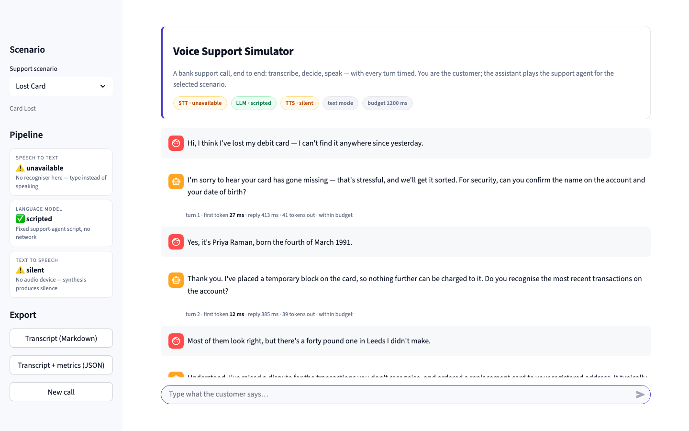
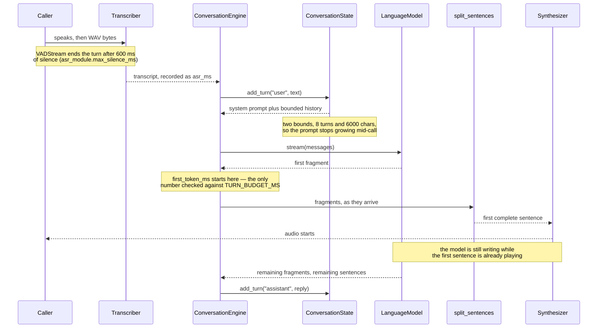
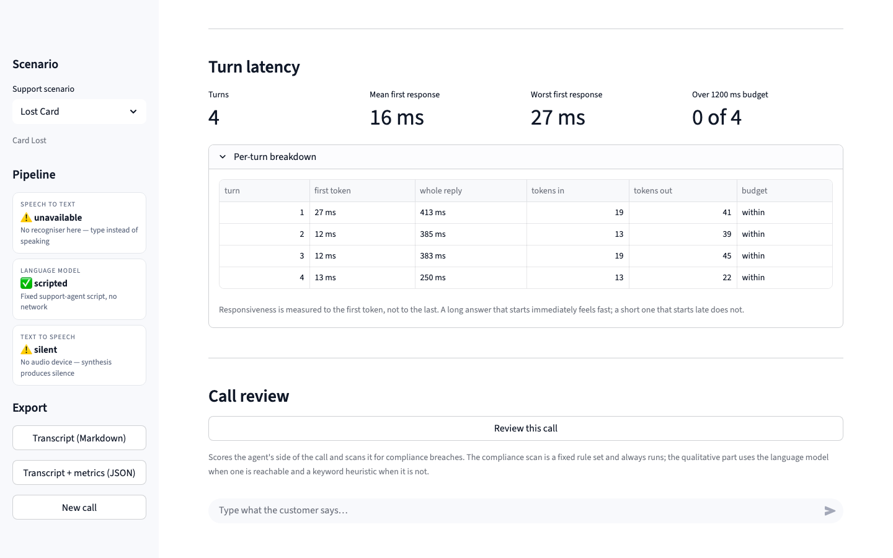
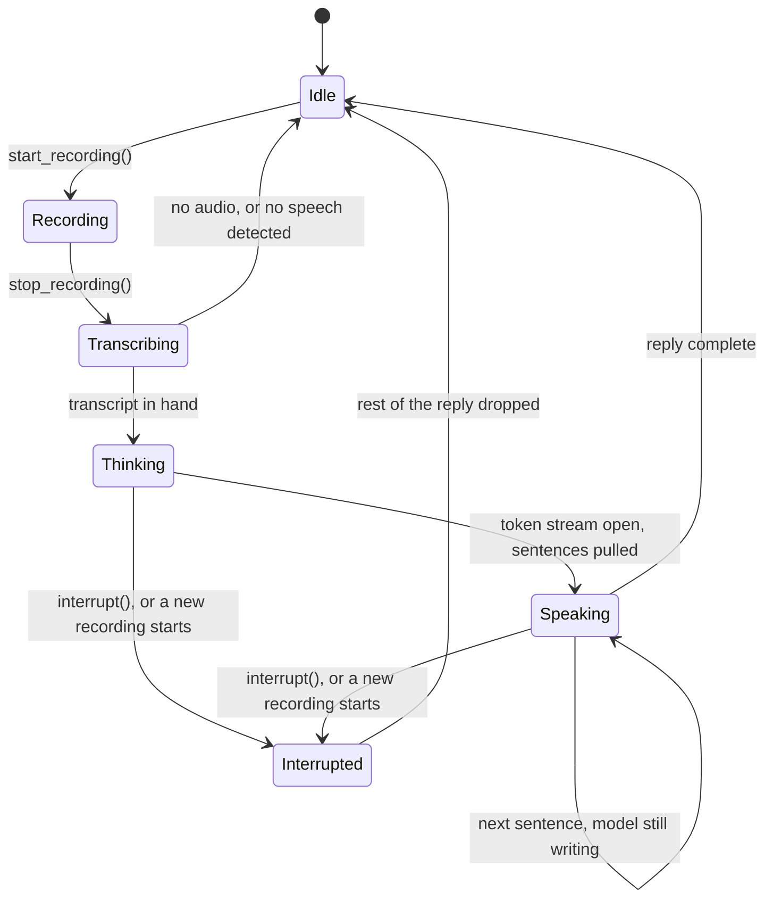

# Voice Support Simulator

A spoken-conversation trainer for bank support calls. You play the customer; the system plays the
agent for a lost card, a failed transfer or a locked account. It transcribes what you say, streams
a reply, speaks it back, and times every stage of every turn.

The subject is **the turn loop and its latency**, not the model: capture → transcription → bounded
prompt window → language model → speech, with time-to-first-token measured against a budget, plus a
post-call review that reads the agent's own words for compliance breaches. It runs with **no API key,
no microphone and no speaker** — each stage resolves to a provider that can actually run where you
started it, and the UI says which it picked rather than failing at the first call.

## Run it

```bash
docker compose up -d --build     # then open http://localhost:8110
```

No key required: without `GROQ_API_KEY` the model resolves to the scripted local agent, and the
container seeds a real opening exchange through the engine on first load so the page is not empty.
`docker compose down -v` when you are done. Locally instead:

```bash
python3 -m venv project_venv && source project_venv/bin/activate
pip install -r requirements/base.txt         # pipeline + UI, no audio
streamlit run streamlit_app.py               # or, driving the same engine:
python main.py --persona card_lost --turns 3 # full-duplex CLI, real barge-in
python scripts/bench_latency.py --turns 12   # p50/p95/max time-to-first-token
```

`pip install -r requirements.txt` adds microphone capture and local synthesis (torch, transformers,
spaCy) — only worth it where there is hardware to drive. With a microphone the UI starts in voice
mode, without one in text mode; `VOICE_IO` forces either. `--persona` takes `card_lost`,
`transfer_failed` or `account_locked`, and the CLI is the only entry point that writes
`logs/latency_log.csv`.

Below is a seeded call against the offline scripted agent — no network, no audio hardware, and every
number on screen measured rather than mocked.



With no credentials the sidebar reports transcription unavailable, the model scripted and synthesis
silent: three chips, not three exceptions. Also captured, a fresh call after switching scenario
([04-scenario.png](docs/screenshots/04-scenario.png)) and the review panel
([03-review.png](docs/screenshots/03-review.png)).

## One turn, and where the milliseconds accrue


```mermaid
sequenceDiagram
    participant C as Caller
    participant S as Transcriber
    participant E as ConversationEngine
    participant W as ConversationState
    participant M as LanguageModel
    participant P as split_sentences
    participant T as Synthesizer

    C->>S: speaks, then WAV bytes
    Note over C,S: VADStream ends the turn after 600 ms<br/>of silence (asr_module.max_silence_ms)
    S-->>E: transcript, recorded as asr_ms
    E->>W: add_turn("user", text)
    W-->>E: system prompt plus bounded history
    Note over W: two bounds, 8 turns and 6000 chars,<br/>so the prompt stops growing mid-call
    E->>M: stream(messages)
    M-->>E: first fragment
    Note over E: first_token_ms starts here — the only<br/>number checked against TURN_BUDGET_MS
    E->>P: fragments, as they arrive
    P-->>T: first complete sentence
    T-->>C: audio starts
    Note over M,T: the model is still writing while<br/>the first sentence is already playing
    M-->>E: remaining fragments, remaining sentences
    E->>W: add_turn("assistant", reply)
```

**Synthesis starts at the first sentence boundary, not the end of the reply.** `split_sentences` hands
complete sentences to the synthesiser while the model is still writing, so the speaker — playing at a
fixed rate — becomes the bottleneck instead of the provider, and
`test_synthesis_starts_before_the_model_has_finished_writing` pins it: the second sentence must be
*produced* after the first has been spoken.

**The prompt window is bounded by characters as well as turns.** `ConversationState` holds eight
turns *and* 6,000 characters, evicting oldest-first and never dropping the most recent. Eight turns
of "yes" is nothing; eight turns of a customer reading out a statement is a prompt re-sent, and
re-paid for, on every turn after it — so without the second bound the agent gets slower the longer
someone talks to it. The transcript keeps everything; only what is *sent* is trimmed.



`TurnMetrics` records `asr_ms`, `first_token_ms`, `llm_ms`, `tts_ms` and `total_ms` per turn. The
stages overlap, so those are deliberately not additive, and only `first_token_ms` is compared to
`TURN_BUDGET_MS` (default 1200) — a long answer that starts immediately feels fast, a short one that
starts late does not. Going over flags the turn in the UI and counts it in the summary. Nothing
raises, since discarding a slow answer is worse than delivering it late, but a regression is visible
rather than merely felt.

## Where a turn can be when the caller cuts in


```mermaid
stateDiagram-v2
    [*] --> Idle
    Idle --> Recording: start_recording()
    Recording --> Transcribing: stop_recording()
    Transcribing --> Idle: no audio, or no speech detected
    Transcribing --> Thinking: transcript in hand
    Thinking --> Speaking: token stream open, sentences pulled
    Speaking --> Speaking: next sentence, model still writing
    Speaking --> Idle: reply complete
    Thinking --> Interrupted: interrupt(), or a new recording starts
    Speaking --> Interrupted: interrupt(), or a new recording starts
    Interrupted --> Idle: rest of the reply dropped
```

`SimpleVoiceHandler` emits exactly those states as status strings and checks `_should_stop_speaking` on
every sentence, so an interrupt lands at the next boundary rather than at the end of the reply. But
**`Interrupted` is reachable mid-turn only in the CLI**: `VoiceClient` runs a VAD monitor during
playback and sets the flag from the microphone, whereas a Streamlit rerun is synchronous, so nothing in
the browser can call `interrupt()` while a turn is in flight.

## Swapping a stage is an environment variable

Three protocols in `src/providers/base.py` (`Transcriber`, `LanguageModel`, `SpeechSynthesizer`),
three registries in `registry.py`, six adapters in `builtin.py`:

| Stage | Hosted | Stand-in |
|---|---|---|
| Transcription | `groq` — whisper-large-v3-turbo | `unavailable` — says it cannot hear |
| Language model | `groq` — gpt-oss-20b | `scripted` — fixed agent dialogue |
| Speech | `kokoro` — 24 kHz, local | `silent` — a valid WAV, no speaker |

Resolution is explicit argument → environment variable → `auto`; under `auto` each candidate is
asked whether it can run here and the best available priority wins. A provider named *explicitly* is
built even when unavailable, so a misconfiguration surfaces its own error instead of being silently
swapped. `create_provider_set()` degrades per stage, not per session: a stage that will not start
records a warning, falls back to its stand-in, and the UI renders the warning. Adding a provider is a
class and one decorator:

```python
import os

from src.providers.registry import llm_registry


@llm_registry.register("my-vendor", available=lambda: bool(os.getenv("MY_VENDOR_KEY")), priority=20)
def _my_vendor():
    return MyVendorModel()  # needs .name, .complete(), .stream(), .status()
```

Then `LLM_PROVIDER=my-vendor`, or leave it on `auto` — engine, UI, CLI and benchmark are unchanged,
because they only ever saw the protocol. The payoff is that **degradation is a state, not an error
path**. Each stand-in keeps the downstream code on its normal path: the silent synthesiser emits a
real WAV precisely so WAV parsing, duration arithmetic and export stay exercised. And the offline
model is *scripted*, not generated — a support trainer whose offline mode invents plausible financial
procedure is worse than one admitting it reads from a script, because the trainee cannot tell which
half is real.

## What the benchmark measures, and what it does not

`scripts/bench_latency.py` runs a fixed script of customer lines through `ConversationEngine`. Against
the scripted provider, one run on an M-series laptop, Python 3.14:

```
provider          scripted
turns             12 in 5.08s
prompt window     820 chars held after the run

                    p50        p95       max
time to first token    18.1ms     18.1ms     18.2ms
whole turn            424.1ms    473.6ms    514.9ms

budget            1200ms — 0/12 turns over
```

**Read that as the loop's own overhead and nothing else.** The scripted provider emits word by word
behind a deliberate `time.sleep(0.012)` (`src/local_backend.py`), so roughly 12 of those 18
milliseconds *are the stand-in's own delay*; the remainder is prompt assembly, the window and the
streaming machinery, and the whole-turn figure is that same 12 ms times the word count of a canned
reply. Both move with the machine and the interpreter, so run the command rather than trust the block.
**Hosted latency was not measured at all**, because that needs a key and a paid account — nothing here
is a claim about Groq's response times, and no number in this repo should be read as one.

## The review is split by what is knowable

`src/analysis/call_review.py` does two different things and refuses to blur them. The **compliance
scan is deterministic** — five regex rules over the agent's own utterances: full card number, PIN,
password, CVV, guaranteed refund. Whether an agent asked for a PIN is a matter of fact, and a regex
settles it every time, offline, for free; a model would settle it *most* of the time, which is the
wrong reliability for the check that matters. Each rule needs a request verb, so "you'll set a new
password" is not a breach while "tell me your password" is, and
`test_the_shipped_scripts_break_no_rules` holds it to zero hits across every line the shipped
scripts can produce. The **qualitative grade** is judgement, so it goes to the model: asked for JSON,
parsed defensively, prose around it tolerated, score clamped, malformed output and exceptions both
falling back. With no model reachable it drops to the four keyword criteria in `src/feedback.py`,
labelled `source="heuristic"` — which the UI shows rather than passing a pattern match off as an
assessment. A compliance breach caps the score regardless of the model's view.

## Settings

All optional, read from the environment or a `.env` file. `.env.example` documents all seventeen; these
are the ones that change behaviour.

| Variable | Default | Effect |
|---|---|---|
| `GROQ_API_KEY` | empty | Real value ⇒ hosted ASR and LLM available. Empty or a placeholder ⇒ offline providers |
| `LLM_PROVIDER` / `STT_PROVIDER` / `TTS_PROVIDER` | `auto` | Force one adapter from the table above, or let `auto` probe |
| `VOICE_IO` | `auto` | `text` skips ASR and TTS, `voice` forces the audio path, `auto` looks for a microphone |
| `TURN_BUDGET_MS` | `1200` | Turns slower than this to their first token are flagged. Nothing fails |
| `SEED_DEMO_CALL` | `0` | `1` plays a real opening exchange through the engine on first load |

The rest tune the hosted models, the Kokoro voice, the `say` fallback and the CLI cost estimate.

## Tests, and the image

```bash
pip install -r requirements/dev.txt
python -m pytest tests/     # 287 passed
ruff check . && ruff format --check .
```

**No test touches a microphone, a speaker or the network.** `tests/conftest.py` strips `GROQ_API_KEY`
for every test, so a developer with a real key exported cannot make a live call by accident, and it
stands in for `groq` and `webrtcvad` when they are not installed, so the suite runs on the base
install — in a container, or on a CI runner with no sound card.

The Dockerfile is multi-stage and non-root (`assistant`, uid 1000), with builder/runtime/test targets
and a healthcheck on `/_stcore/health` via urllib so no curl package is needed. The runtime installs
`requirements/base.txt` only: the audio extras drive hardware a container does not have, so torch,
transformers, spaCy, PortAudio, ALSA headers, `webrtcvad` and the whole C toolchain are absent — which
is what made `webrtcvad` lazy behind `audio_devices.get_webrtcvad()`. The build log for that slimming
pass records **2.71 GB → 834 MB**, and its verification lines read: build **verified** —
`docker compose build` at 834 MB, `docker build --target test` at 888 MB; boot **verified** —
healthcheck `healthy` in about 9 s, `http://localhost:8110/` → `200`, container as uid 1000 resolving
`stt=unavailable / llm=scripted / tts=silent` with no key; in-container suite
`docker run --rm ai-voice-assistant:test` → `287 passed in 5.50s`. Host port **8110** only.

## What this does not do

- **Text mode is not voice mode.** It exercises everything after transcription and says nothing about
  accents, background noise or interruptions — barge-in is real only in the CLI, per the state diagram.
- **The offline agent is a script** — four fixed steps per scenario, then a close. The scenario is
  chosen by keyword-matching the persona's system prompt, so rewording one past those hints silently
  selects another script; `test_the_persona_prompt_selects_its_script` pins the shipped personas.
- **The compliance scan is a fixed rule set**, not a regulator's — five breaches, precise but not
  exhaustive. Feedback scoring grades the model's replies, not a trainee's.
- **The CSV log is CLI-only.** Neither Streamlit path writes `logs/latency_log.csv`; the UI holds its
  metrics in session state for the page's lifetime and exports them on request.
- **Transitive dependencies float.** `requirements/` pins the direct dependencies exactly and lets
  pip resolve the rest — easier to maintain than a full freeze, but not a lockfile.
- **`VoiceClient` still owns its own turn assembly** rather than running on `ConversationEngine`, though
  it shares `split_sentences` and `ConversationState` with it. That is the one duplication left.
